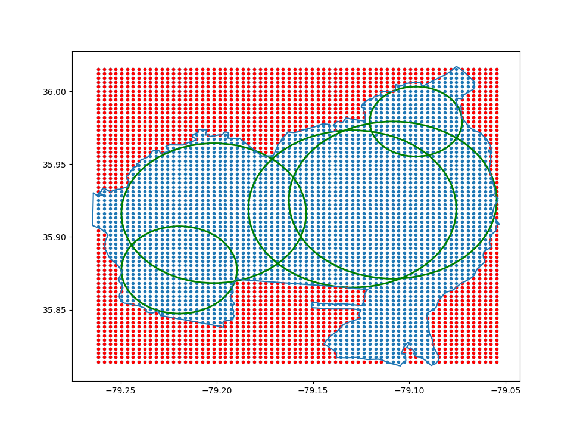

This repository includes processing tools for GeoJSON representations of polygons. Given GeoJSON represents a zipcode. Files pursue two primary goals, as described in boundaries.md:
1. Testing if a point is in a polygon
insidepolygon.py uses a horizontal scan to determine if a point is inside a given polygon, written in python to confirm algorithm is functional. It accounts for edge cases such as a horizontal edge. Allows for use with non-contiguous polygons and polygons with internal holes, as illustrated by the followint illustration:

pointinpoly.rb utilizes the same algorithm, additionally implemented alongside a GeoJSON to confirm compatability with the desired datatype. Written in ruby as requested.
1. Converting a polygon to a collection of circles
polytocircles.py converts a given polygon to a collection of circles that do not intersect the outside boundary. It does so by first discretizing the polygon into a collection of points, then choosing the circle that includes the most new points upon each iteration. Grain of points and quantity of circles are given as parameters alongside the polygon. Written alongside a processed GeoJSON to confirm compatability. Example of algorithm with .003 grain and 5, 10, and 20 circles:

polytocirclesspiral.py is an algorithm in progress to iterate from center points to optimize time. spiral.py illustrates the concept of spiral access to an np array.